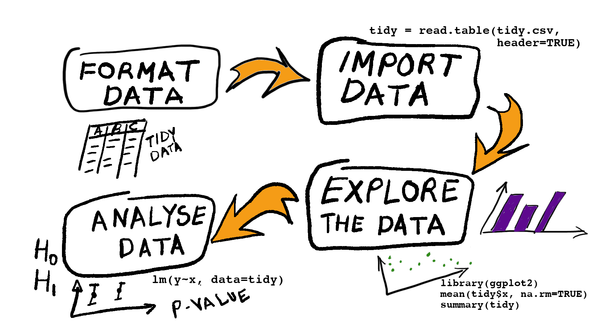

# Data analysis workflow

{width=100%}


We're going to concentrate upon steps 3 and 4 of the workflow


# Steps 1 & 2: Tidy and import your data

The data are in a "comma-separated variable" format which is relatively easy to import using R's import functions (e.g. `read.table()` or `read.csv()`). 


```{r}
# Import climate data for six European cities for the period 1970-2022
climate = read.table('climate_change.csv', 
                     sep=',', 
                     header=TRUE)
```

Check that the imported data look OK.

Look at the first few lines of data
```{r}
# Look at first 6 lines of the imported data
head(climate)
```


Now look at a summary of the data
```{r}
# A summary of the data
summary(climate)
```


And the structure of the data frame, showing the data types
```{r}
# The structure of the data
str(climate)
```


## Wrangling the data

Location is a qualitative variable, so make sure this is set to be a `factor` 

```{r}
# Make sure location is a factor
climate$location = as.factor(climate$location)
```


Let's also add a variable that defines two periods: 1970-1979 and 2010-2019
```{r}
# Define two time periods
climate$period = NA
climate$period[climate$year>=1970 & climate$year<1980] = "1970s"
climate$period[climate$year>=2010 & climate$year<2020] = "2010s"
climate$period = as.factor(climate$period)
```


And we'll produce a subset that's just data for Dublin
```{r}
dublin_climate = subset(climate, location=="Dublin")
```


# Step 3: Explore your data

Plotting the data is a great way to explore the data

```{r message=FALSE}
library(ggplot2)

# Plot mean temperature for the six locations
ggplot(data=climate,
       aes(x=year,
           y=summer_dailyTmean,
           colour=location)) +
  geom_point() + 
  geom_smooth(se=FALSE) + 
  theme_bw()
```


Looks like temperatures are increasing in some locations, but maybe not all. 

Another figure that compares the 1970s to the 2010s for Dublin

```{r}
# Plot mean temperature for the six locations
ggplot(data=dublin_climate,
       aes(x=period,
           y=summer_dailyTmean,
           fill=period)) +
  geom_boxplot() + 
  theme_bw()
```


# Step 4: Analyse the data

We'll investigate whether:

> the summer daily mean temperature for Dublin (the **response variable**) has been linearly increasing with year (the **explanatory variable**) between 1970 and 2022.

For this we will use a **linear model** to describe the summer daily mean temperature for Dublin form 1970 to 2022.

The model is described by the formula `response ~ 1 + explanatory`, where `response` is the name of the response variable and `explanatory` is the name of the explanatory variable.  

We use the `lm()` command to fit the model:
```{r}
# Fit a linear regression model for mean daily temperature in Dublin
m_dublin = lm(summer_dailyTmean~1+year, 
              data=dublin_climate)
```


## Validate the model

In order to use the model to draw reliable conclusions about Dublin's climate we must ensure that the model is able to generate data that is reasonably realistic. 

In other words we must validate that the model's assumptions are reasonably valid.  

Some important assumptions are:  

  1. The residuals from the fitted model are independent of one another (independence assumption)
  2. The variance of residuals from the fitted model is the same across all values of the explanatory variables (homogeneity of variance assumption)
  3. The residuals from the model follow a normal distribution (normality assumption)
  4. A linear relationship is an appropriate description 
  5. The is little uncertainty in the values of the explanatory variable

### Residual versus fitted validation plot 
Test whether: 

  + variance is homogeneous
  + the linear relationship is appropriate
  
using a residual versus fitted plot  
```{r}
# Ptot a residual versus fitted
plot(m_dublin, which=1)
```  


### Quantile-Quantile validation plot

Test whether: 

  + residuals follow a normal distribution
  
using a Q-Q plot  
```{r}
# Plot a residual versus fitted
plot(m_dublin, which=2)
```  


### Leverage plot

Test whether: 

  + any one data point is having too much influence on the model fit
  
using a Cook's distance leverage plot.

This isn't an assumption of the model, but it ensures that our result comes from the bulk of our data, not  one or two data points. 

Here's the plot
```{r}
# A leverage plot showing Cook's distance
plot(m_dublin, which=4)
```  

Cook's distance greater than 1 indicates observations that have a large effect on the fitted model. All looks good here.


## Hypothesis test

Yay. We have a valid model, so now we can start using it to ask questions about the world (in this case Dublin's climate over the last 50 years).

> First question: Has Dublin's summer temperature been linearly increasing from 1970 until 2022?

We turn this question into a hypothesis:

> H~1~: The summer daily mean temperature in Dublin has linearly increased from 1970 until 2022

and write the corresponding null-hypothesis

> H~0~: The summer daily mean temperature in Dublin has no relationship with year between 1970 and 2022


We've already fitted the model that corresponds to the hypothesis (that's our model `m_dublin`).

So now we fit the model for the null-hypothesis, which means removing `year` as an explanatory variable

```{r}
# Fit the null model
m_null = lm(summer_dailyTmean~1, 
              data=dublin_climate)
```  


We then **test the null-hypothesis** by comparing the null-model (`m_null`) to the full-model (`m_dublin`) using the `anova()` function.

```{r}
anova(m_null, m_dublin)
```  

P-value (=0.017) is less than 5%, so we have evidence to **reject the null-hypothesis**. Summer mean daily temperature in Dublin has increased from 1970 until 2022.


## Estimating the Effect Size

So we conclude that summer temperatures have been increasing. The next question is:

> How quickly have temperatures been increasing in Dublin?

This is a question asking us to **estimate** the slope of the linear relationship between temperature and year (this slope is the **effect size** that is of interest). 

For this we must look at a summary of the full-model.

```{r}
summary(m_dublin)
```
### The estimate:
The estimate of the slope is in the part labelled `## Coefficients:`. The slope of the linear relationship is `r signif(coef(m_dublin)['year'],2)`. 

### The uncertainty in the estimate
We also need to report the uncertainty in the estimate. A good way to do this is using the **95% confidence interval**

```{r}
confint(m_dublin)
```

The 95% confidence interval in the slope of the linear relationship is `r signif(confint(m_dublin)['year',1],2)` - `r signif(confint(m_dublin)['year',2],2)`. 

# Reporting the results

## In the main text
In a report include the following pieces of information in the main text:
  
  + A sentence in **plain English* describing the conclusions from your analysis
  + The statistical evidence supporting your conclusions (a minimum of test statistic, degrees of freedom and p-value)
  +  *If the null-hypothesis has been rejected*, the estimate of the effect size and its uncertainty


Here's an example of how to report the above analysis

> Summer daily temperatures in Dublin have shown a linear increase of `r round(coef(m_dublin)['year'],3)` ^o^C year^-1^ (95% CI: `r round(confint(m_dublin)['year',1],3)` - `r round(confint(m_dublin)['year',2],3)`) from 1970 to 2022 (F~`r summary(m_dublin)$fstatistic[2]`,`r summary(m_dublin)$fstatistic[3]`~=`r signif(summary(m_dublin)$fstatistic[1],2)`, p=`r signif(anova(m_null, m_dublin)$'Pr(>F)'[2],2)`).


## In a figure
You could also include a figure the visualises the result. For our analysis the figure would show:

  1. the estimated linear relationship
  2. the uncertainty in the linear relationship
  3. the original data
  

### Prepare the data to be plotted

First obtain the predicted relationship and the 95% confidence interval
```{r}
# Model predictions and 95% confidence interval
predictions = predict(m_dublin,
                      interval='confidence',
                      level=0.95)
```

Then save these predictions in the original data frame `dublin_climate`

```{r}
dublin_climate$pred = predictions[,1]         # Model prediction 
dublin_climate$pred_lwrCI = predictions[,2]   # Lower 95% CI of prediction
dublin_climate$pred_uprCI = predictions[,3]  # Upper 95% CI of prediction
```


### Plot the predictions and the original data

```{r}
ggplot(data=dublin_climate,            # Define the data to be plotted
       aes(x=year,
           y=pred,
           ymin=pred_lwrCI,
           ymax=pred_uprCI)) +
  
  # Specify the plot
  geom_ribbon(alpha=0.3) +               # Make 95% CI semi-transparent
  geom_path() +                          # Plot the predicted linear relationship 
  geom_point(aes(y=summer_dailyTmean)) + # Plot the original data

  # Specify the styling of the plot
  labs(x='Year',
       y='Daily Mean Summer Temperature (deg C)') +
  theme_bw()
```


### Figure caption
The figure needs a caption, which could be:

> Figure 1: The linear increase in daily summer temperature for Dublin between 1970 and 2022 (F~`r summary(m_dublin)$fstatistic[2]`,`r summary(m_dublin)$fstatistic[3]`~=`r signif(summary(m_dublin)$fstatistic[1],2)`, p=`r signif(anova(m_null, m_dublin)$'Pr(>F)'[2],2)`). Shown are the data (solid points), the predicted relationship (solid line) and its 95% confidence interval (shaded region).